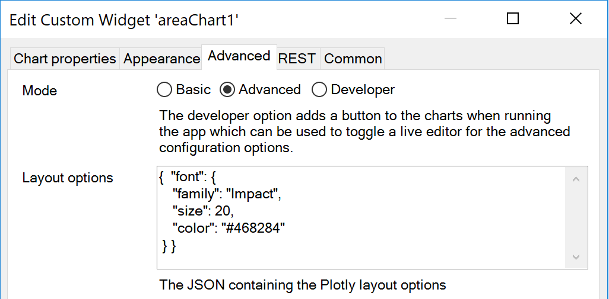
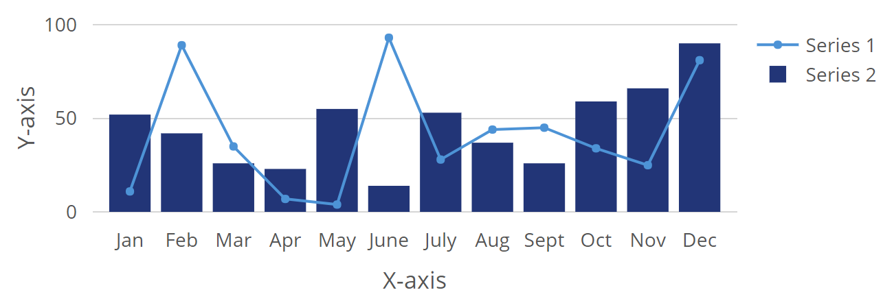

## 1 Introduction

The individual Charts widgets can be fine tuned with advanced settings. The setting can affect the layout, configuration and data.

**This how-to will teach you how to do the following:**  

* Change font style (layout)
* Change chart type (Data)
* Enable toolbar (configuration)

## 2 Prerequisites

Before starting this how-to, make sure you have completed the following prerequisites:

* Installed the latest Mendix modeler
* Downloaded the latest [Chart Widget](https://appstore.home.mendix.com/link/app/105695/) from the Mendix App Store
* Setup a chart, see [How to create a chart](charts-basic-create)

## 3 Changing Layout<a name="layout-changes"></a>

Before:


To create a custom layout, follow these steps:

1. Open a project with a chart
1. Open the page with the charts widget
1. Open the charts widget settings
1. Go to the tab **Advanced**
1. Set the **Mode** to **Developer**

1. Run the project
1. In your browser, open the page with the chart
1. Click on the button **Toggle Editor**
1. In the **Layout** section add the **Custom setting**

```json
{
  "font": {
    "family": "Open Sans",
    "size": 14,
    "color": "#555"
  }
}
```
10. Change the font settings, till the chart shows the required font. Copy the font settings.

{}

Please note that the editor changes will never persist, and need to be stored in the advanced settings of the widget or stored in the theme.

{}

After:

11. Paste the new font settings into the **Layout options** property in the tab **Advanced**

12. Change the **Mode** back to **Advanced** in the  modeler, this will remove the Toggle Editor button from the chart.  

{}

Please note that the advanced settings only apply to the chart in mode Advanced or Developer

{}

## 4 Changing Data

Before:


To create a custom configuration, follow these steps:

1. Repeat steps 1 to 8 from the [layout instructions](#layout-changes)
1. Select the from the drop down menu the name of the series, in this case **Series 1**
1. Edit the **Custom settings**, change it to *{ "type": "line" }*

1. Copy the the custom settings
1. In the modeler, open the **Series 1** configuration
1. Paste the new configuration for the data into the **Configuration options** options property in the tab Advanced


After:


## 5 Changing Configuration 

To create custom a configuration, follow these steps:

1. Repeat steps 1 to 8 from the [layout instructions](#layout-changes)
1. Select the from the drop down menu **Configuration**
1. Edit the **Custom settings**, change it to *{ "displayModeBar": true }*
1. Add more Custom settings as desired. See [here](https://plot.ly/javascript/configuration-options/) for more configuration settings 
1. The changes in the editor are not persistent, copy the required settings
1. Paste the new configuration into the **Configuration options** options property in the tab Advanced

1. Change **Mode** to **Advanced** set modeler, to remove the **Toggle Editor** button.

{}

Please note that the advanced settings only apply to the chart in mode Advanced or Developer

{}


## 6 References

Reference guide for the [advanced properties](../../refguide/charts-configuration#advanced)

Layout options [cheat sheet](../../refguide/charts-advanced-cheat-sheet##layout-all)  
Configuration options [cheat sheet](../../refguide/charts-advanced-cheat-sheet#config-options)  
Data options [cheat sheet](../../refguide/charts-advanced-cheat-sheet#data-series)  

Full reference https://plot.ly/javascript/

## 7 Related Content
