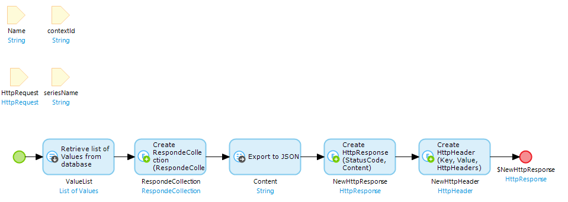

## 1 Introduction

{Add the introduction text here}

**This how-to will teach you how to do the following:**

* Create...
* Build...
* Configure...

## 2 Prerequisites

{If there are no prerequisites, leave this section out}

Before starting this how-to, make sure you have completed the following prerequisites:

* {Prerequisite 1}
* {Prerequisite 2}

## 3 {Title of Section [Use Present Participle Verb/Gerund]} 

To {do this task}, follow these steps:

1. {Step 1}
2. {Step 2}

### 3.1 {Title of Sub-Section}

## 4 Related Content

TODO Format content into template
# REST endpoint setup

* When retrieving data from a REST endpoint, a Data Point entity (non persistent entity) and the attribute(s) are required.

* Create an export mapping which specifies how the entity relates to the JSON.

* Create a rest API which returns the Http response.

* Then publish the API.

For more information on publishing a rest API refer to Mendix [REST documentation](https://docs.mendix.com/refguide/published-rest-operation?utm_source=businessmodeler&utm_medium=software&utm_campaign=modeler)
