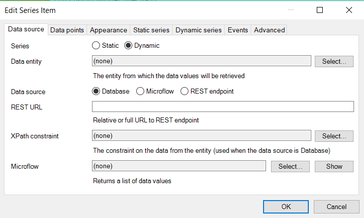
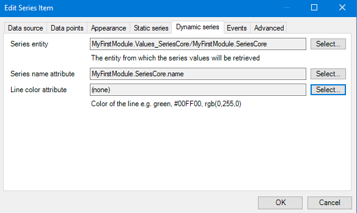

## 1 Introduction

The charts widget provides the basic implementation of dynamic series

**This how-to will teach you how to do the following:**

* Create a chart with dynamic series.

## 2 Prerequisites

Before starting this how-to, make sure you have completed the following prerequisites:

* Install latest mendix modeler
* Download latest [Charts Widget](https://appstore.home.mendix.com/link/app/105695/) from the Mendix App Store

## 3 Configure the Charts Widget

## 3.1 Set up the Domain model

In order to create the Charts widget with dynamic series, a specific data structure is set up.

1. Configure your domain model to contain an entity **Value** with attributes **xValue**, **yValue**  
1. Add another entity **Series** with attributes, **name**, **color**, **fillColor**.
1. Add an association **Value_Series** between the two entities  

## 3.2 Add Chart Configurations

To configure a Charts widget with dynamic series, follow these steps:

1. Open the page with the Charts widget
1. Right click, select **properties**
1. In the tab **Chart properties**, add a new **series** property  

1. In the tab **Data source**, select **Dynamic**  

1. Select **Data entity** from which the data values will be retrieved  
1. Set the **Data source** as **Database** or **Microflow**
1. In the tab **Dynamic series**, select the **Series entity**  
1. Add the **Series name attribute** and **Line color attribute**

1. Add the charts page to user navigation  

## 3.3 View Chart

To view the chart, follow these steps:

1. Run the project  
1. Open the page with dynamic series chart  

## 4 Related Content

* [How to create a basic chart](charts-basic-create)
* [How to fine tune a chart, with advance settings](charts-advanced-tuning)
* [How to use Any Chart](charts-any-usage)
