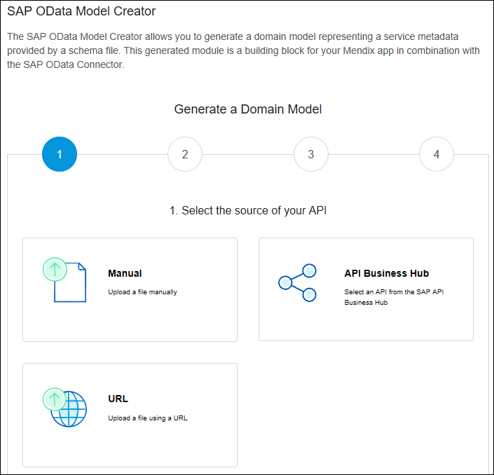
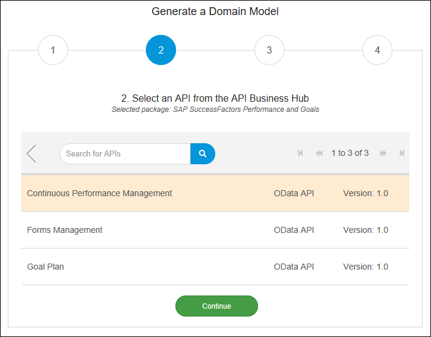
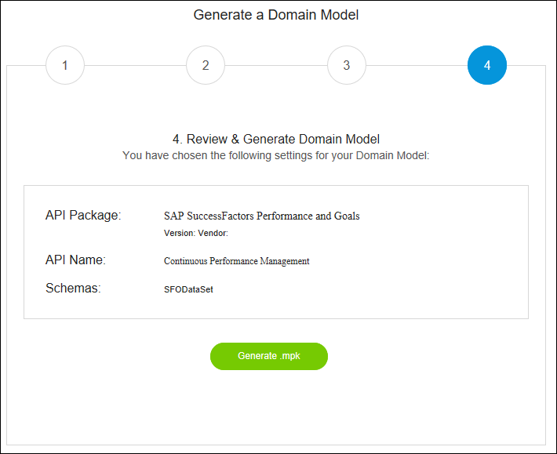

## 1 Introduction

SAP data models reflect an OData service from SAP back-end systems like SAP Business Suite (SAP ERP 6.0), SAP S/4HANA, and SAP S/4HANA Cloud. OData services are exposed via the SAP Gateway and are described in a `$metadata` file, which describes all the entities, relationships, and functions that are exposed for that service.

Handcrafting a Mendix domain model for these OData services would be a lot of work. The SAP OData Model Creator automates this process by creating a Mendix module for the selected service containing the Mendix domain model which can be imported in your project.

There are three ways to do this:

* [Using the API Business Hub](#APIBusHub)
* [Providing URL to Metadata](#URL)
* [Uploading an Odata Metadata XML File](#Uploading)

## 2 Prerequisites

Before starting this how-to, make sure you have completed the following prerequisites:

* identify the SAP back-end system and OData service you wish to use

## 3 Generating a Data Model

The SAP OData Model Creator is an app in the App Store. Search for it in the Mendix App Store, or find it here: [SAP OData Model Creator](https://sapodatamodelcreator.mendixcloud.com/). 

{}
The SAP OData Model Creator is not currently available in the App Store within the Desktop Modeler. It can only be run in a browser.
{}

1. Open the [SAP OData Model Creator](https://sapodatamodelcreator.mendixcloud.com/).

You will be asked how you want to generate your model.

There are three ways to generate your data model.

* If your SAP back-end system stores the OData API package on the SAP API Business Hub, then you can create the create the data model from there; select **API Business Hub** as the source and continue with section [3.1 Using the API Business Hub](#APIBusHub)
* If you have access to the metadata file or metadata URL for the SAP back-end OData, then select **Manual** and continue with section [3.2 Generating the Model Manually](#Manually)

### 3.1 Using the API Business Hub

Your SAP back-end OData API is held in the API Business Hub.

{}
There may be several schemas in the packages of an API. Each of these will generate a module. Depending on the functionality of your app, you may have to generate several modules and import all of them into your app.
{}

1. Click on **API Business Hub**

    You will be presented with a list of packages containing OData API definitions. You can search this list (this includes text in the package description as well as the package name), and page through it using the paging buttons.

    

    {}
    You can return to any stage in this process by clicking on the relevant step number.
    {}

2. Click on the package you want. It will be highlighted.

3. Click on **Continue** to see the APIs within the package.

    

    {}
    This will be shown even if only one API exists.
    {}

4. Click on the API you want. It will be highlighted.

5. Click on **Continue** to see the schemas within the API.

    

    {}
    This will be shown even if only one Schema exists.
    {}

6. Click on the schema you want. It will be highlighted.

7. Click on **Continue** to proceed to the confirmation screen.

    

8. Click on **Generate .mpk** to generate the data model module.

    

9. Click **Download File**.

Your browser will offer options on what to do with the file.

10. Save the file locally. It is recommended that you save it in the **resources** folder of your Mendix app so that you can find it easily.

You have now created the module. Section [4 Using the Data Model Module in a Mendix App](#Using) explains how to import it into your app.

### 3.2 Generating the Model Manually

You may want to generate the data model by hand using the `$metadata` file directly. This may, for example, not be in the API Business Hub.

For this documentation, we use the publicly available HCM People Profile service, for which [https://www.sapfioritrial.com/sap/opu/odata/sap/HCM_PEOPLE_PROFILE_SRV/$metadata](https://www.sapfioritrial.com/sap/opu/odata/sap/HCM_PEOPLE_PROFILE_SRV/$metadata) is the metadata file.

#### 3.2.1 Providing URL to Metadata

The simplest way of generating the data model from the metadata is just to provide the URL to the SAP OData Model Creator.

{}
This method does not work where the destination needs authentication. For example, you cannot use it to generate 
{}

#### 3.2.2 [Uploading an Odata Metadata XML File]

Generating an SAP data model starts by getting an OData metadata XML file. This file can be download from the OData service URL directly using the `$metadata` suffix or retrieved from the SAP Gateway. Your SAP Gateway administrator can provide the file for you.

With the file available, go to the [SAP OData Model Creator](https://sapodatamodelcreator.mendixcloud.com/) web page. For this documentation, we use the publicly available HCM People Profile service, for which [this](https://www.sapfioritrial.com/sap/opu/odata/sap/HCM_PEOPLE_PROFILE_SRV/$metadata) is the metadata file.

To generate the data model, follow these steps:

1. Save the file to your hard drive.
2. Open the [SAP OData Model Creator](https://sapodatamodelcreator.mendixcloud.com/).
3.  Upload the OData Schema XML file:

    

4. Press **Generate .mpk**. A progress bar will be shown during the parsing and generation of the module.
5.  Once the generation is done, the **Download File** button appears. Notice that the file name of your data model module is extracted from the metadata file itself.

    

## 4 Using the Data Model Module in a Mendix App

Now you have a Mendix module ready to import into your project. Open the project which you created as a prerequisite. Right-click your project in the **Project Explorer** and select **Import module package...**.

You now have your service **HCM\_PEOPLE\_PROFILE\_SRV** module available in your project ready to use in combination with the SAP OData Connector.

Now you are ready to use the imported data model together with the SAP OData Connector. For more information, see [How to Use the SAP OData Connector](/howto/sap/use-sap-odata-connector).

<!-- 

* Create the app in the Mendix Desktop Modeler 7.5.1 or higher

* Get the SAP OData Connector (see below)

### 2.1 Getting the SAP OData Connector

To be able to use the OData Connector, create your project and then navigate to the Mendix App Store to download the [SAP OData Connector](https://appstore.home.mendix.com/link/app/74525/Mendix/SAP-OData-Connector). You will then find this module in your app project's App Store modules.

For details on using Mendix App Store connectors, see [How to Use App Store Content in the Modeler](/community/app-store/use-app-store-content-in-the-modeler).
-->

## 5 Related Content

* [HCM People Profile Service sample metadata](https://www.sapfioritrial.com/sap/opu/odata/sap/HCM_PEOPLE_PROFILE_SRV/$metadata)
* [How to Use App Store Content in the Modeler](/community/app-store/use-app-store-content-in-the-modeler)
* [How to Use the SAP OData Connector](/howto/sap/use-sap-odata-connector)
* [SAP OData Connector](https://appstore.home.mendix.com/link/app/74525/Mendix/SAP-OData-Connector)
* [SAP OData Model Creator](https://sapodatamodelcreator.mendixcloud.com/)
